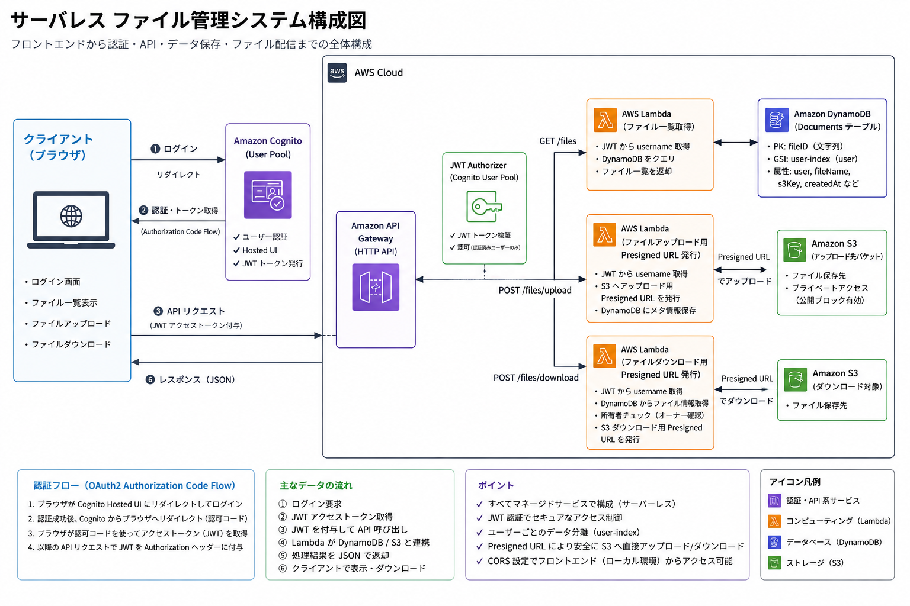

# 社外公開向けファイル安全監査・管理システム（AWSサーバーレス基盤）

## 1. プロジェクト概要
本システムは、「IT専門知識の少ない社内環境」「納期限1か月強」において、「年度初めなどのスパイクアクセスに対応」しつつ、「最小限の運用コスト」で安全に社外向け資料（マニュアル、広報資料、レポート等）を保管・監査・公開するためのサーバーレスWebアプリケーションです。

単にファイルを共有するだけでなく、CognitoによるJWTトークン認証、および他人のファイルをダウンロードさせない認可制御（owner確認）を組み込み、実務で要求される高いセキュリティレベルを担保しています。

## 2. システム構成図
フロントエンドのWebシステムにてログインすることでCognitoから認証・トークン取得する。そしてバックエンドはAPI Gateway + Lambda + S3 + DynamoDBの完全サーバーレス構成を採用しています。



## 3. 技術選定の理由（設計思想）
AWS Well-Architected Framework の
以下観点を意識して設計。

* **コスト最適化 ＆ パフォーマンス効率化（AWS Lambda & Amazon API Gateway）**
  * 繁忙期（年度初め・中旬）と閑散期の利用頻度の差が激しいという要件に対し、アイドルタイムの無駄なコストをゼロにするためサーバーレスを採用。アクセス急増時にも自動スケールし、パフォーマンスを維持します。
* **運用の優秀性 ＆ セキュリティ（Amazon Cognito Hosted UI）**
  * 社内のIT運用リソースが少ないため、自前で認証基盤やユーザーデータベースを保守管理するリスクを徹底排除。既存環境のユーザー管理を流用できるよう、Cognitoによるマネージド認証を導入しました。
* **パフォーマンス効率化（Amazon DynamoDB & user-index GSI）**
  * ユーザーごとのファイル一覧を高速かつ安価にクエリするため、セカンダリインデックス（GSI）として `user-index`（Partition Key: `user`）を設計。実務におけるDB設計のベストプラクティスを意識しました。
* **セキュリティ（Amazon Cognito & 物理バケットの分離）**
  * Amazon Cognito Hosted UI を利用した OAuth2 / OpenID Connect ベースの認証を導入。JWTトークンをAPI Gateway JWT Authorizerで検証し、認証済みユーザーのみがAPIへアクセス可能な構成としました。
  * また、Lambda側ではJWT claimsから取得したusernameを利用し、DynamoDB上の所有者情報（owner）と照合する認可制御を実装。他人のファイルへアクセスできないよう制御しています。
  * ユーザーからの自由なアップロードを受け付ける `uploads/`（一時保存バケット）と、所定の形式に修正済みの正規ファイルを保管する `documents/`（本番バケット）を**物理的に分離**。
  * 各LambdaのIAMロールを「最小権限の原則」に基づき、必要なオブジェクトへの操作（`PutObject` / `GetObject` 等）のみに厳密に制限しています。


## 4. 開発における課題解決（トラブルシューティング）

構築の過程で直面したインフラ・セキュリティ面での課題と、それを自力で原因特定・解決したプロセスです。

#### ① フロントエンドからのファイルアップロード時の接続エラー（CORS問題）
* **不具合：** 署名付きURLを用いたフロントからのS3アップロード時にCORSエラーが発生。
* **原因：** API Gateway、S3バケット双方のCORSヘッダー定義の不一致、およびLambda（URL発行関数）におけるレスポンスヘッダーの未定義。
* **解決：** API GatewayのCORS設定を最適化するとともに、Lambda側の共通レスポンス関数に適切なCORSヘッダー（`Access-Control-Allow-Origin` 等）を明記。さらにプリフライト（`OPTIONS`）リクエストへのハンドリングを実装し解決しました。

#### ② 認可不備によるデータ漏洩リスクの解消（固定値問題からの脱却）
* **不具合：** 初期構築時、フロントHTML側のユーザー名が `taro` などの固定値になっており、API側でもそのまま受け入れていたため、実質的に他人のファイルを操作できる脆弱性があった。
* **原因：** 静的HTMLでのモックアップ段階のロジックが残っていたこと、およびAPI Gateway側での適切な認可制御が未実装だった。
* **解決：** 1. Amazon Cognitoを導入し、Hosted UI経由でログインしたユーザーに「IDトークン（JWT）」を発行するフローへ変更。
  2. ダウンロード用Lambda側で、トークンのクレームから動的にユーザー名を識別（`event.requestContext.authorizer.jwt.claims.username`）。
  3. DynamoDBから取得したデータの所有者（`item.user`）と、リクエストしたユーザー名が一致するかを検証する**認可制御（owner確認）**を実装。不一致の場合は `403 Forbidden` を返す本番仕様へ改善しました。

## 5. 今後の展望・フェーズ2での実装計画（To-Be）

本システムは、限られた開発期間の中で「コア機能の安定稼働とセキュリティの土台構築」をフェーズ1（現在）として完了しています。新年度からの本番運用、および運用の自動化・さらなるセキュリティ強化に向けて、以下のフェーズ2実装を計画しています。

### ① Amazon Macieによる機密情報（個人情報等）の自動スキャンと監査の自動化
* **背景：** 社外公開を想定したシステムであるため、ユーザーが誤ってマイナンバー、クレジットカード番号、個人情報（PII）が含まれたファイルをアップロードしてしまうリスクがあります。
* **対策：** `uploads/` バケットにファイルが保存された際、Amazon Macieの自動データ検出ジョブを連動させます。機密情報が検知された場合は、処理Lambda側で本番バケットへの移動をブロックし、管理者に通知（Amazon SNS経由）する「自動監査パイプライン」を構築予定です。

### ② Amazon CloudFrontの導入によるエンドポイント隠蔽とスパイクアクセス対策
* **背景：** 現状のフロントエンドはAPI Gatewayへ直接リクエストを送信しており、かつ年度初めなどのアクセス急増（スパイク）に対するキャッシュ戦略が未実装です。
* **対策：** フロントエンドの配信基盤、およびAPI Gateway/S3の全面にAmazon CloudFrontを配置します。
  * オリジンアクセス制御（OAC）を設定し、S3への直接アクセスを完全に遮断。
  * CloudFrontのエッジキャッシュを活用することで、バックエンド（Lambda/DynamoDB）の負荷を大幅に軽減し、年度初めの急激なスパイクアクセス時にも低遅延かつ低コストでスケールする構成へアップデートします。

## 6. ディレクトリ構造

```text
aws-serverless-file-share/
├── README.md               # 本ドキュメント
├── Demo-serverless-file-share.png   # システム構成図画像
├── Front_Show&Download_HTML             # フロントエンド（静的コンテンツ）
├── Front_Upload_HTML         # アップロード用画面
├── Lambda_Download      # ダウンロード用署名付きURL発行（JWT認証・所有者チェック付き）
├── Lambda_Edit          # S3イベント通知トリガー：ファイル編集＆DynamoDBメタデータ保存    
├── Lambda_Show          # DynamoDB GSIを利用したユーザーごとのファイル一覧取得
├── Lambda_Upload        # S3アップロード用の署名付きURL発行


